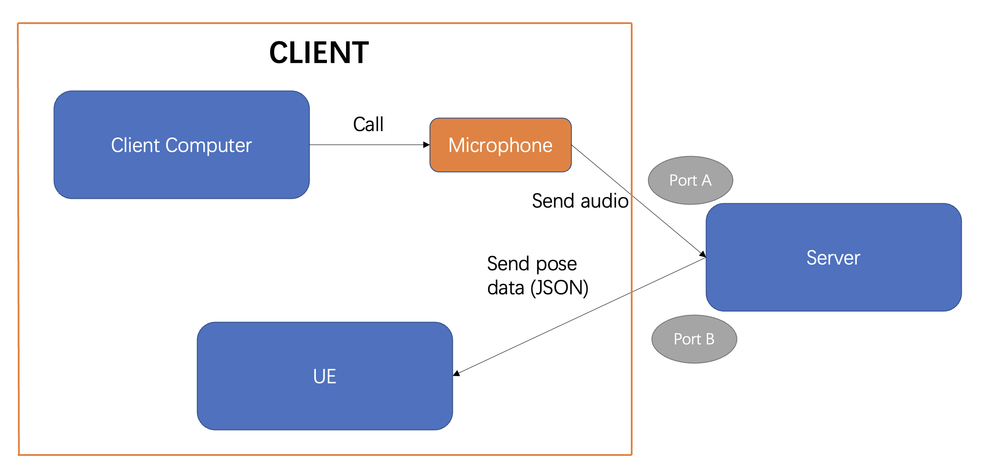

# AI_sign_language

## Setup

Download the `sgg.zip` file from the **ASL Lexicon Pose files** in the **Releases** section. After extracting the zip file, place the `sgg` folder under the `assets/dummy_lexicon` directory.

Python version: 3.9.21

```
pip install -r requirements.txt
```

Add the OpenAI API key in `spoken_to_signed/config.py`.

## Usage

cd `spoken_to_signed/whisper_streaming`

Change the `lexicon_path` in `whisper_online_server.py` : `"XXX/XXX/assets/dummy_lexicon"`

### Server

```
python whisper_online_server.py --warmup-file samples_jfk.wav --lan en --backend openai-api
```

You can also use `--host` and `--port` to change the *host* and *port*. 

### Client

For MacOS:

```
ffmpeg -f avfoundation -i ":0" -ar 16000 -ac 1 -f s16le - | nc localhost 43007
```

For Linux:

```
arecord -f S16_LE -c1 -r 16000 -t raw -D default | nc localhost 43007
```

For Windows:

To list available devices, run:

```
ffmpeg -list_devices true -f dshow -i dummy
```

Find your microphone or audio device name and replace `"Microphone (Realtek Audio)"` with that name in the command.

```
ffmpeg -f dshow -i audio="Microphone (Realtek Audio)" -ar 16000 -ac 1 -f s16le - | nc localhost 43007
```

Using `Control+C`  to quit the programs

## Results

Pipeline:  Real-time speech to text to gloss to pose

Input file (poem audio): `poem_audio/New_Orleans_Function.mp3`

(Use another device to play this audio to simulate real-time situations.)

Output files: `spoken_to_signed/whisper_streaming/output/pose/`

**Calculation of Delay Time**: In the Server program's output, locate the `Start_time` (in green text) when the first line of poetry's audio is received. Then, find the `Start_time` (in green text) when the last line of poetry is processed and the next silence audio is received. The difference between these two times represents the program's total processing time (in seconds).

## Two-Channel Server Socket

Using socket to receive audio streaming and send pose data.

### Workflow



### Server

Change the `lexicon_path` in `sign_language_server.py` : `"XXX/XXX/assets/dummy_lexicon"`

In `Class ServerProcessor:` , you can set your Unreal Engine IP and the port where UE listens for Pose data. (Port B)

```
# UE port
self.UE_HOST = "your-ue-ip" # Unreal Engine IP
self.UE_PORT = 43008  # The port where UE listens for Pose data

self.socket = socket.socket(socket.AF_INET, socket.SOCK_STREAM)
self.socket.connect(("127.0.0.1", self.UE_PORT))  # ((self.UE_HOST, self.UE_PORT))
```

You can also use `--host` and `--port` to change the host and port for (Audio Streaming) Port A.

```
python sign_language_server.py --warmup-file samples_jfk.wav --lan en --backend openai-api
```

### Client

(Port A: sent audio) For Client Computer Microphone: Same as above.

(Port B: receive pose data) For UE: (Unfinished)


P.S.: Pay attention to the server startup order. First open Port B on UE, and then start `sign_language_server.py`.

